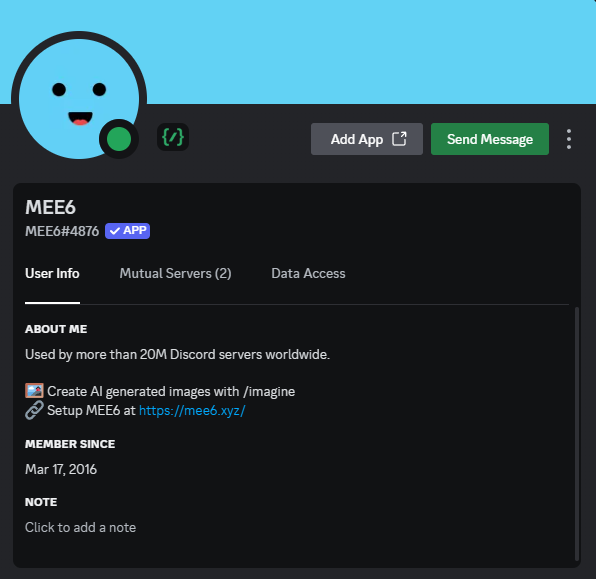
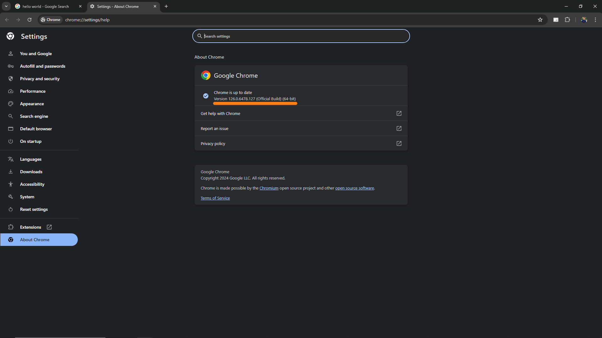

# Discord Mee Bot Bypass

> How many times do you entered a Public Discord and MEE6 stopped you from participated on giveaway or a specific chat? With this code you will reach levels sending automated messages, just keep sending the code running until you reach the necessery level.

## 💻 Requirements

Before begin, verify you have the following requirements:

- You have `Python with latest version` on your computer.
- You installed throught PIP `pyautogui and selenium` package.
- You have the `ChromeDriver` with the specific version of your `Google Chrome` version.

## 🚀 Installing

To install the Discord Mee Bot Bypass, follow these steps:

<h3>Install Python</h3>

1- Access Microsoft Store

2- Use the search bar and search `Python`

3- Click on `Python` option

4- Click on `lastest version`

5- Click on `Get` to download and install Python

<h3>Install PyAutoGUI and Selenium</h3>

1- Press `Win + R` and type `cmd`

2- Click `OK`

3- Run the command `pip3 install pyautogui`

4- Run the command `pip3 install selenium`

<h3>Install ChromeDriver</h3>

1- Click the `⋮` button

2- Click `Help` button

3- Click `About Google Chrome` button

4- Check the Google Chrome version

5- Enter the following link: https://googlechromelabs.github.io/chrome-for-testing/#stable and found the version `based on your OS`

6- Copy the link and entered as a new tab

7- After download, click the `zipped file`

8- Enter the  `folder`

9- Find the `EXE file`

10- Move the `EXE file` to the `script folder`

## 🔧 Change Variables

<h4>Set the chat channel link</h4>

>For example, if the chat channel link is https://discord.com/channels/1232448776917221487/1238845907706056784 the first sequence of X would be `1232448776917221487` and the second sequence would be `1238845907706056784`

<h4>Set the Discord server cooldown</h4>

>Change the server cooldown in seconds, for example 60 seconds for 1 minute cooldown

<h4>Set your credentials</h4>

>Add the e-mail and password to login into Discord, I recommend to disable MFA (Multi-factor authentication) before execute the script and enable again after script finish

<h4>Set messages</h4>

>Change the `TEXT` messages for real messages so you don't get blocked

## 🤝 Contribute with the Project

Want to be part of the project? Click [HERE](CONTRIBUTING.md) and read how to contribute.

## 📝 License

Esse projeto está sob licença. Veja o arquivo [LICENÇA](LICENSE.md) para mais detalhes.